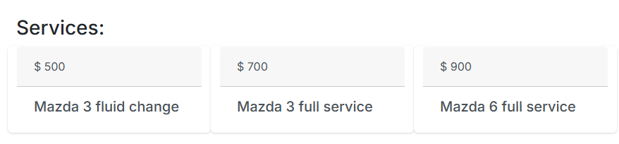
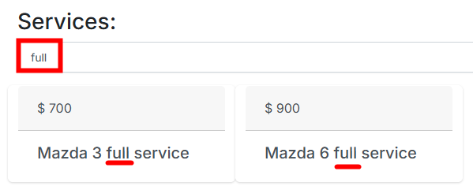

# Practical Exercise: Extending the Seeder and Finish Implementing Workshop Services Search

## Objective

We'll extend the CarWorkshopSeeder with more workshops and their services, then implement functionality to search for services within a specific workshop.

## Part 1: Extending the Seeder

### Step 1: Add more car workshops to the seeder

Open [CarWorkshopSeeder.cs](..\CarWorkshop.Infrastructure\Seeders\CarWorkshopSeeder.cs) and use Copilot to help extend the Seed method:

```csharp
// Add more car workshops to the seeder
```

After placing this comment, Copilot will suggest code to add additional workshops.

### Step 2: Add workshop services to the seeder

In the same file, add another comment:

```csharp
// Add seeding for workshop services
```

Let Copilot generate code that adds services to the workshops.

## Part 2: Implementing Service Search

Finish the implementation of the 'search' feature for car workshop services

### Current state

In the details page for a car workshop service, currently all of it's services are displayed



The goal is to add a search text input, with which users will be able to filter only matching services


## Existing Car Workshop Services Display Feature

The car workshop services display feature allows users to view services associated with a particular car workshop, with potential search functionality. Here's how it works:

## UI Components

### Views

1. **Details View** - [CarWorkshop.MVC/Views/CarWorkshop/Details.cshtml](..\CarWorkshop.MVC\Views\CarWorkshop\Details.cshtml)

   - Displays workshop details
   - Contains a services section with an empty div that will be populated with services

   ```html
   <h3>Services:</h3>
   <div id="services" class="row" data-encoded-name="@Model.EncodedName"></div>
   ```

### JavaScript

1. **site.js** - [CarWorkshop.MVC/wwwroot/js/site.js](..\CarWorkshop.MVC\wwwroot\js\site.js)

   - Contains core functions for loading and rendering services

   ```javascript
   // Function to load services via AJAX
   const LoadCarWorkshopServices = () => {
     const container = $("#services");
     const carWorkshopEncodedName = container.data("encodedName");

     $.ajax({
       url: `/CarWorkshop/${carWorkshopEncodedName}/CarWorkshopService`,
       type: "get",
       success: function (data) {
         if (!data.length) {
           container.html("There are no services for this car workshop");
         } else {
           RenderCarWorkshopServices(data, container);
         }
       },
       error: function () {
         toastr["error"]("Something went wrong");
       },
     });
   };
   ```

## Backend Components

### Controller

The `CarWorkshopController` in [CarWorkshop.MVC/Controllers/CarWorkshopController.cs](..\CarWorkshop.MVC\Controllers\CarWorkshopController.cs) handles both displaying and creating services:

```csharp
// Endpoint to get workshop services
[HttpGet]
[Route("CarWorkshop/{encodedName}/CarWorkshopService")]
public async Task<IActionResult> GetCarWorkshopServices(string encodedName, [FromQuery] string searchPhrase)
{
    var data = await _mediator.Send(new GetCarWorkshopServicesQuery() { EncodedName = encodedName, SearchPhrase = searchPhrase });
    return Ok(data);
}

```

As part of the feature, `GetCarWorkshopServicesQuery` has been extended with the `SearchPhrase` property and also the `GetCarWorkshopServices` action gets a `searchPhrase` parameter from the HTTP query, which then is passed to `GetCarWorkshopServicesQuery`.

## To be implemented with Copilot

Your task is to finish the search feature implementation

### Step 1: Adjust the query handler

Open [GetCarWorkshopServicesQueryHandler.cs](..\CarWorkshop.Application\CarWorkshopService\Queries\GetCarWorkshopServices\GetCarWorkshopServicesQueryHandler.cs):

Use copilot to add the filtering logic, before returning `dtos`
Try using general prompt like i.e.:

```csharp
// filer services
```

This might result in code hallucinations, with compilation errors, so a better approach would be:

```csharp
// filter services based on the request.SearchPhrase and their descriptions
```

### Step 2: Add a text input for the search phrase

Modify [Details.cshtml](..\CarWorkshop.MVC\Views\CarWorkshop\Details.cshtml) to display the search input just below the `<h3>Services:</h3>` node:

Try using inline chat (CTRL+I)

> _I need a text input with which i will be able to filter the services, call LoadCarWorkshopServices on key press_

### Step 3: Add JavaScript for dynamic search

Update [site.js](..\CarWorkshop.MVC\wwwroot\js\site.js) `LoadCarWorkshopServices` with a search capabilty:

Try using Copilot chat completion, by just typing below the line:

```javascript
    const carWorkshopEncodedName = container.data("encodedName");
    const searchPhraseValue = ...
```

If Copilot finished only single line (instead of the rest of the function), try typing the next line of code as:

```javascript
    const carWorkshopEncodedName = container.data("encodedName");
    const searchPhraseValue = $("#searchPhrase").val();

    if (search..
```

> **NOTE**
>
> Github Copilot completion is not aware of the context outside of the current file, thus the `id` property of the search phrase input text might be different between `Details.cshtml` and the `site.js` files, which results in a broken feature.

## Expected Outcome

After completing this exercise, your application should:

1. Have multiple workshops with various services in the database
2. Allow users to view services for a specific workshop
3. Include functionality to search for services within a workshop by name

This exercise demonstrates practical use of GitHub Copilot for both expanding existing functionality and creating new features within the CarWorkshop application architecture.

---
